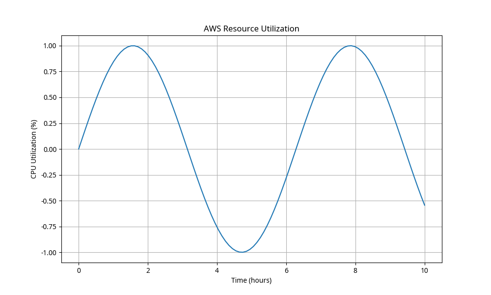

# AWS Swiss Army Toolkit

<div align="center">
  
  <br>
  <em>Powerful automation scripts for AWS resource management and optimization</em>
  <br><br>
</div>

[](https://github.com/x0VIER/aws-toolkit/stargazers)
[](https://github.com/x0VIER/aws-toolkit/network/members)
[](https://github.com/x0VIER/aws-toolkit/blob/master/LICENSE)
[](http://makeapullrequest.com)

*Authored by V Vier*

A comprehensive collection of Python and Bash automation scripts for AWS resource management, monitoring, security, and cost optimization.

## 🚀 Overview

This toolkit provides powerful automation scripts to help AWS administrators and developers manage their cloud resources more efficiently. The scripts are organized into categories based on their functionality:

- **Resource Management**: Scripts for creating, configuring, and cleaning up AWS resources
- **Monitoring**: Tools for setting up CloudWatch dashboards, alarms, and log analysis
- **Security**: Scripts for auditing IAM users, analyzing security groups, and finding public resources
- **Cost Optimization**: Tools for rightsizing resources and optimizing AWS costs
- **Networking**: Scripts for managing VPCs, subnets, and network configurations
- **Backup & Recovery**: Tools for automating backups and implementing disaster recovery

## 📋 Tools Overview

### Resource Management

| Script | Description |
|--------|-------------|
| `ec2_instance_manager.py` | Comprehensive EC2 instance management |
| `s3_bucket_manager.py` | S3 bucket creation and configuration |
| `cleanup_unused_resources.sh` | Identify and remove unused AWS resources |

### Monitoring

| Script | Description |
|--------|-------------|
| `cloudwatch_dashboard_creator.py` | Creates comprehensive CloudWatch dashboards for various AWS services |
| `metric_alarm_manager.py` | Manages CloudWatch alarms for different metrics and services |
| `log_analyzer.py` | Analyzes CloudWatch Logs for patterns, errors, and insights |
| `health_check_monitor.py` | Sets up health checks and monitoring for AWS resources |

### Security

| Script | Description |
|--------|-------------|
| `iam_user_audit.py` | Security audit for IAM users |
| `security_group_analyzer.py` | Analyze security groups for vulnerabilities |
| `public_resource_finder.py` | Identifies AWS resources that are publicly accessible |

### Cost Optimization

| Script | Description |
|--------|-------------|
| `resource_rightsizer.py` | Analyzes resource utilization and provides rightsizing recommendations |
| `reserved_instance_analyzer.py` | Analyzes EC2 usage patterns and recommends Reserved Instance purchases |
| `savings_plan_analyzer.py` | Analyzes compute usage and recommends Savings Plan purchases |
| `cost_anomaly_detector.py` | Detects unusual spending patterns and sends alerts |
| `idle_resource_finder.sh` | Identifies idle or unused resources that can be terminated |
| `cost_allocation_tagger.py` | Helps implement and enforce cost allocation tagging strategies |

## 🏁 Getting Started

### Installation

These scripts require the AWS CLI and Python 3.6+ with boto3 installed.

```bash
# Install dependencies
pip3 install boto3 tabulate colorama matplotlib pandas

# Clone the repository
git clone https://github.com/x0VIER/aws-toolkit.git
cd aws-toolkit

# Make scripts executable
chmod +x */*.py */*.sh
```

### Configuration

The scripts use the AWS credentials and configuration from your environment. You can specify a profile or region when running the scripts.

```bash
# Configure AWS CLI if not already done
aws configure
```

### Usage Examples

#### Resource Rightsizer

```bash
# Analyze all resources
./cost-optimization/resource_rightsizer.py --service all

# Export results to HTML report
./cost-optimization/resource_rightsizer.py --export report.html --export-format html
```

#### Public Resource Finder

```bash
# Find all public resources
./security/public_resource_finder.py

# Find specific public resources
./security/public_resource_finder.py --service s3
```

#### CloudWatch Dashboard Creator

```bash
# Create an EC2 dashboard
./monitoring/cloudwatch_dashboard_creator.py --type ec2 --name my-ec2-dashboard
```

## 📋 Prerequisites

- AWS account with administrator access
- Python 3.6 or higher
- AWS CLI installed and configured
- Required Python packages: boto3, tabulate, colorama, matplotlib, pandas

## ⚠️ Important Notes

- Some scripts may make changes to your AWS resources. Always review the script actions before running.
- Always test scripts in a non-production environment first.
- Scripts that analyze resources may incur AWS API charges if run frequently on large environments.

## 🔗 Related Repositories

- [AWS Labs](https://github.com/x0VIER/aws-labs) - A comprehensive collection of AWS labs from beginner to expert level

## 📚 Additional Resources

- [AWS CLI Documentation](https://docs.aws.amazon.com/cli/latest/userguide/cli-chap-welcome.html)
- [Boto3 Documentation](https://boto3.amazonaws.com/v1/documentation/api/latest/index.html)
- [AWS Well-Architected Framework](https://aws.amazon.com/architecture/well-architected/)

## 🤝 Contributing

Contributions are welcome! Please feel free to submit a Pull Request.

1. Fork the repository
2. Create your feature branch (`git checkout -b feature/amazing-feature`)
3. Commit your changes (`git commit -m 'Add some amazing feature'`)
4. Push to the branch (`git push origin feature/amazing-feature`)
5. Open a Pull Request

## 📄 License

This project is licensed under the MIT License - see the LICENSE file for details.

## 👤 Author

**V Vier**

- GitHub: [@x0VIER](https://github.com/x0VIER)

---

<div align="center">
  <p>⭐ Star this repository if you find it useful! ⭐</p>
  <p>Created with ❤️ by V Vier</p>
</div>
